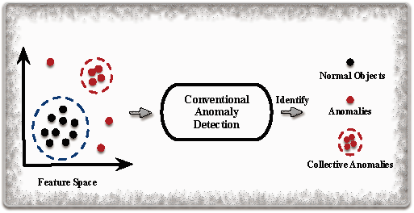
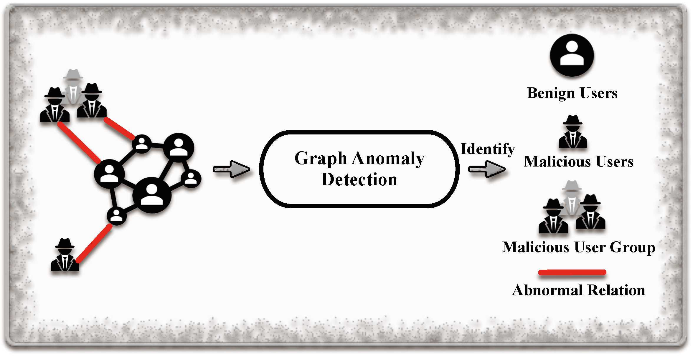
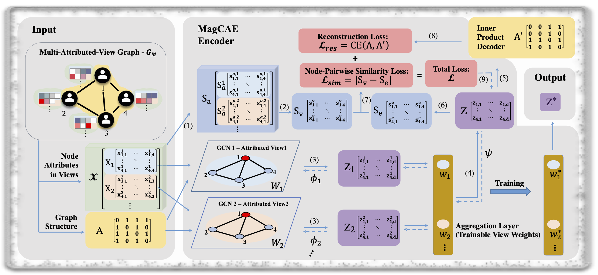
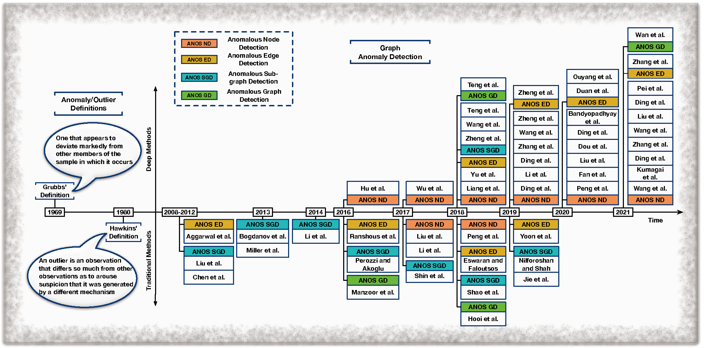

<!--
 * @Author: XiaoxiaoMa-MQ xiaoxiao.ma2@hdr.mq.edu.au
 * @Date: 2022-05-30 23:18:09
 * @LastEditors: Xiaoxiao Ma
 * @LastEditTime: 2022-06-01 13:17:09
 * @FilePath: /XiaoxiaoMa-MQ.github.io/index.md
-->

## Xiaoxiao Ma
### Ph.D. Candidate at Macquarie University

School of Computing

Macquarie University

Email: xiaoxiao.ma2@hdr.mq.edu.au or xiaoxiao.ma2@students.mq.edu.au

I am a 1st year Ph.D. student at the School of Computing, Macquarie University. My pricipal supervisor is Prof. [Jian Yang](http://web.science.mq.edu.au/~jian/) and my associate supervisor is Dr. [Jia Wu](http://web.science.mq.edu.au/~jiawu/). My research mainly focus on deep learning, graph mining and anomaly detection. I got my Master of information technology degree from the University of Melbourne and Master of research degree from Macquarie University.

##  Education Background

| Year | Degree | Major | University |
| ----- | ------ | ------- | -------- |
| 2021.10 - Now | Doctor of Philosophy | Computing | Macquarie University |
| 2020.1 - 2021.2 | Master of Research | Computing | Macquarie University |
| 2014.3 - 2014.12 | Master | Information Technology | University of Melbourne |
| 2006.9 - 2010.7 | Bachelor | Software Engineering | Tianjin University |

##  Work Experience

| Year | Company/Organization | Role | 
| ----- | ---------------- | ------------- |
| 2018.10 - 2019.11 | Data center of Ningxia Gov | Senior Staff member |
| 2015.5 - 2018.10 | Information data management center of HRSS, Ningxia | Senior Staff member |
| 2010.7 - 2013.9 | Ericsson (China) Communications Co.Ltd. | Integration Engineer |

##  My Publications

[1] **Xiaoxiao Ma**, Jia Wu, Shan Xue, Jian Yang, Chuan Zhou, Quan Z. Sheng, Hui Xiong, Leman Akoglu, “Deep Multi-Attributed-View Graph Representation Learning”, IEEE Transactions on Network Science and EngineeringEngineering (**TNSE**, JCR impact factor 5.213, Google H-index: 29), 2022. [[PDF]](https://ieeexplore.ieee.org/document/9782548)   [[CODE]](https://github.com/MagCAE/magcae) <cr>

[2] **Xiaoxiao Ma**, Jia Wu, Shan Xue, Jian Yang, Chuan Zhou, Quan Z. Sheng, Hui Xiong, Leman Akoglu, “A Comprehensive Survey on Graph Anomaly Detection with Deep Learning”, IEEE Transactions on Knowledge and Data Engineering (**TKDE**, CORE ranked A*, CCF A, Web of science impact factor: 4.935, Google H-index: 174), 2021. [[PDF]](https://ieeexplore.ieee.org/abstract/document/9565320)   [[REPOSITORY]](https://github.com/XiaoxiaoMa-MQ/Awesome-Deep-Graph-Anomaly-Detection)<cr>

[3] Richard O. Sinnott, Jun Han, William Hu, **Xiaoxiao Ma**, Kuai Yu, “Application of Mobile Games to Support Clinical Data Collection for Patients with Niemann-Pick Disease”, IEEE 28th International Symposium on Computer-Based Medical Systems (**CBMS**), 2015. [[PDF]](https://ieeexplore.ieee.org/abstract/document/7167444)<cr>

## Hosted Project
 * Awesome Deep Graph Anomaly Detection [[Github]](https://github.com/XiaoxiaoMa-MQ/Awesome-Deep-Graph-Anomaly-Detection)

## Awards

| Year | Award | Organized by |
| ----- | ---------------- | ------------- |
| 2021 | Executive Dean's Commendation for Academic Excellence in Year 2 Master of Research |  Macquarie University |
| 2018 | The Third (Silver Medal) in the 2nd Network Hacking Competition |  Ningxia |
| 2017 | Award of Encouragement in the 1st Network Hacking competition |  Ningxia |
| 2016 | Information Technology Project Management Professional | P.R.C. |
| 2016 | Annual Best Staff | HRSS Ningxia |
| 2015 | Network Engineer Certification | P.R.C. |
| 2007| Bronze Medal in The Tianjin Metropolitan Collegiate Programming Contest | ACM |

##  Research Activities 
 * Journal Reviewer
     - ACM Transactions on Knowledge Discovery from Data
     - World Wide Web Journal
     - IEEE Transactions on Emerging Topics in Computing
     - IEEE Transactions on Neural Computing
     - IEEE Transactions on Emerging Topics in Computing
     - Journal of Information Science
     - Neural Nerworks
 * Conference Reviewer
     - The IEEE International Conference on Data Mining (ICDM) 2021
     - The ACM Conference on Web Search and Data Mining (WSDM) 2021
     - The Conference on Information and Knowledge Management (CIKM) 2021
     - The IEEE International Conference on Big Knowledge (ICBK) 2021
     - International Joint Conference on Neural Networks (IJCNN) 2021, 2022
     - The ACM SIGKDD conference on Knowledge Discovery and Data Mining (KDD) 2021